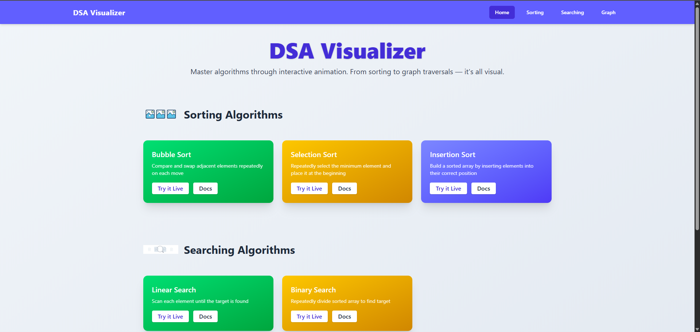
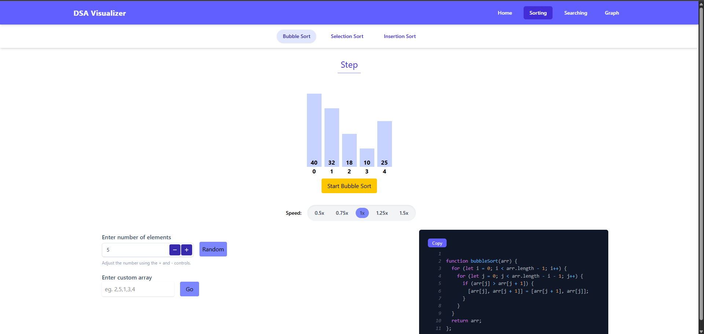

# 🧠 DSA Visualizer

**DSA Visualizer** is a web-based interactive tool to help students and developers understand core Data Structures and Algorithms through beautiful, animated visualizations. Whether you're brushing up on concepts or preparing for interviews, this app is designed to enhance your learning with real-time visual feedback, code snippets, and complexity analysis.

---

## 🚀 Features

- 📊 **Visualize Algorithms** — Sorting, Searching, Graph traversal, and more
- 🎥 **Smooth Animations** — Step-by-step visualization powered by Lottie animations & Framer Motion
- 💡 **Tooltips & Docs** — Understand each algorithm with quick descriptions and modal-based docs
- 📜 **Code Blocks** — Syntax-highlighted code with one-click copy
- 📈 **Time & Space Complexity** — Displayed in an intuitive format
- 🔍 **Filter/Search** — Quickly find the algorithm you want
- 🎨 **Clean UI** — Minimalist, responsive, and developer-focused interface

---

## 🖼️ Demo

👉 **Live Demo:** [https://dsa-visualizer-algorithm.vercel.app/](https://dsa-visualizer-algorithm.vercel.app/)





---

## 📂 Project Structure

```
DSA_Visualizer/Frontend/
├── public/
├── src/
│   ├── assets/              # Lottie animations and screenshots
│   ├── components/          # Reusable UI components (e.g. Modal, Navbar)
│   ├── data/
│   │   └── sections.jsx     # Algorithm metadata & code snippets
│   ├── pages/
│   │   └── Home.jsx         # Main visualizer UI
│   └── App.jsx              # Routes & main layout
├── package.json
└── README.md
```

---

## 🛠️ Tech Stack

| Frontend | Libraries |
|----------|-----------|
| React    | Framer Motion |
| JSX      | Lottie React  |
| CSS      | React Syntax Highlighter |

---

## 🧠 Algorithms Included

- ### 🔢 Sorting
  - Bubble Sort
  - Insertion Sort
  - Selection Sort
  - Quick Sort *(coming soon)*
  - Merge Sort *(coming soon)*
  - Heap Sort *(coming soon)*

- ### 🔍 Searching
  - Linear Search
  - Binary Search

- ### 🌐 Graphs
  - DFS (Depth First Search)
  - BFS (Breadth First Search)
  - Dijkstra's Algorithm *(coming soon)*
  - A* Algorithm *(coming soon)*

> Tip: You can add more algorithms easily by updating `sections.jsx`.

---

## 🖱️ Usage

### 1. Clone the repo

```bash
git clone https://github.com/yourusername/DSA_Visualizer.git
cd Frontend
```

### 2. Install dependencies

```bash
npm install
```

### 3. Run locally

```bash
npm run dev
```

The app will be available at `http://localhost:5173`

---

## 🧩 Add Your Own Algorithm

1. Go to `src/data/sections.jsx`
2. Add a new object to the appropriate category (`sorting`, `searching`, `graph`, etc.)
3. Provide:
   - `label`, `description`, `timeComplexity`, `spaceComplexity`
   - `code` block (JavaScript, C++, Python, etc.)

```js
{
  label: "Selection Sort",
  description: "Sorts an array by repeatedly finding the minimum element...",
  timeComplexity: "O(n²)",
  spaceComplexity: "O(1)",
  code: {
    javascript: `function selectionSort(arr) { /*...*/ }`,
    python: `def selection_sort(arr): #...`,
  },
}
```

---

## 🧪 Contributing

Pull requests are welcome! Here's how to get started:

- Fork the repository
- Create your feature branch (`git checkout -b feature/new-algo`)
- Commit your changes
- Push to the branch and open a PR

---

## 🧑‍💻 Author

**Sk Ramiz Raja**  
Full Stack Developer | MERN Enthusiast | B.Tech CSE @ ITER  
GitHub: [@skramizraja](https://github.com/skramizraja)

---

## 📜 License

This project is licensed under the [MIT License](LICENSE).

---

## 📌 TODO

- [ ] Add pathfinding algorithms (Dijkstra, A*)
- [ ] Include Tree traversals (Inorder, Preorder, Postorder)
- [ ] Add runtime controls (pause, resume, speed)
- [ ] Enable mobile drag gestures

---

⭐ If you like this project, consider giving it a star on GitHub!
